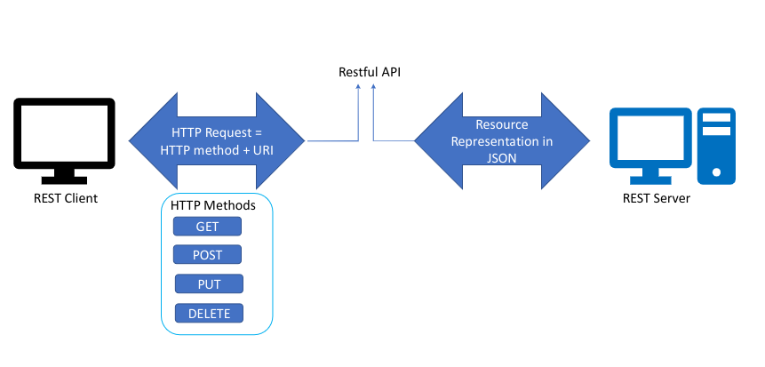
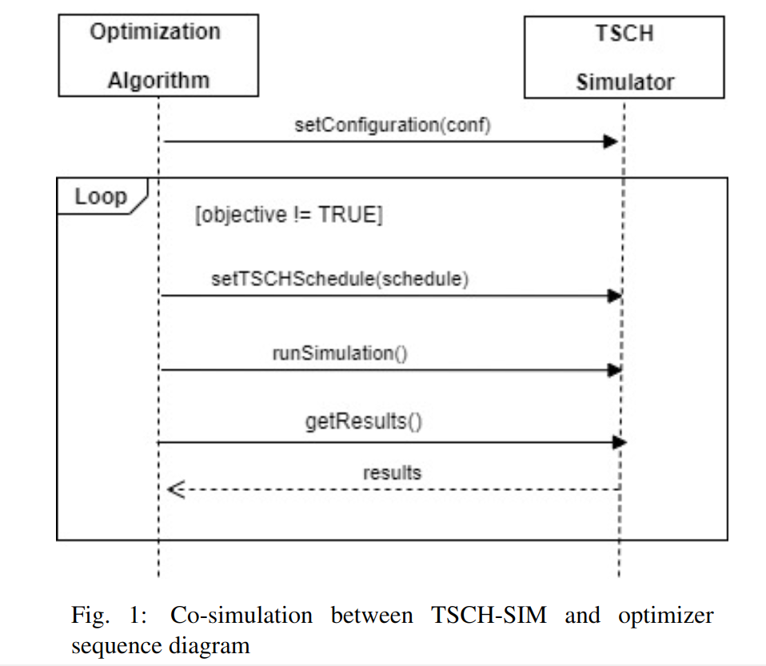

# TSCH-Sim Co-simulation

Co-simulation is an important concept in the optimization of computer networks because a typical optimization scenario integrates an optimization algorithm with a network simulator. In many cases optimization algorithms are implemented in the MATLAB environment while network simulators are implemented as stand alone applications. This project presents enhancements to the TSCH-Sim network simulator in order to facilitate its integration with an optimization algorithm. The core enhancement is the definitions and implementation of a set of REST APIs for TSCH-Sim that allows a remote optimization algorithm to set the network configuration, routes, and 802.15.4e TSCH schedule of a sensor network. The significance of the REST API is demonstrated through the integration of a Differential Evolution based TSCH scheduling optimizer executing in MATLAB leveraging the TSCH-Sim simulator through the REST APIs in order to find a TSCH schedule that maximizes throughput.

# System architecture

